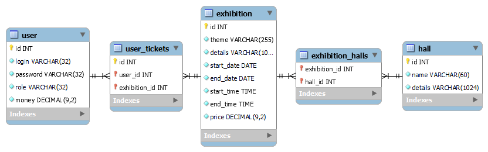

# ExhibitionProject
- EXHIBITION PROJECT DESCRIPTION 
There are roles: user, authorized user, administrator.
The administrator makes a list of exhibitions (theme, hall, period of operation and working hours, ticket price), and can also cancel exhibitions, view statistics of visits. The exhibition can occupy one or several halls.
The user can view the exhibits by topic, ticket price, and filter by date.
An authorized user can buy a ticket to the selected exhibition.
-----------------------
Based on:
- Java 8
- Apache Tomcat 9
- MySql 8
-----------------------

Created users:
admin - admin
user1 - 11111
user2 - 22222
user3 - 33333

Acttions:
Not authorised user:
- see exhibitionі sorted by parametrs
- see halls

Authorised user:
- see exhibitionі sorted by parametrs
- see halls

on User panel:
- buy tikets
- view tikets
- return tikets if exhibition not it the past
- add user funds
- print tikets

Admin:
- see exhibitionі sorted by parametrs
- see halls
- see statistics of visitors by exhibitions
- cancel exhibitions if they not in the past (corespondent records remain) with refund
- delete exhibitions if they not in the past (corespondent records deleted) with refund

on Amdin panel:
- see what hall and when is occupied
- add exhibitions
- view list of all users
- search user
- delete user

